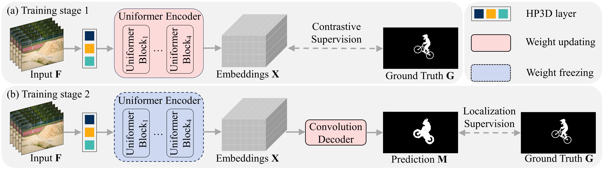

## Video Inpainting Localization with Contrastive Learning
An official implementation code for paper "Video Inpainting Localization with Contrastive Learning". This repo provide codes and trained weights.

## Framework
<p align='center'>  
  
</p>
<p align='center'>  
  <em>Proposed video inpainting localization scheme ViLocal. Each 5 consecutive frames is set as an input unit to yield the inpainting localization map of the middle frame. (a) Training stage 1. ViLocal utilizes contrastive supervision to train the encoder network. (b) Training stage 2. ViLocal employs localization supervision to train the decoder network. </em>
</p>

## Dependency
- torch 1.7.0
- python 3.7

## Datasets
1. [DAVIS2016](https://davischallenge.org/)
2. [DAVIS2017](https://davischallenge.org/)
3. [MOSE](https://github.com/henghuiding/MOSE-api)
4. [VOS2k5-800](https://www.123684.com/s/2pf9-9bWHv) (in this paper we use 800 videos from VOS2k5)

The `MOSE100` dataset in this paper can be found in [this](https://www.123684.com/s/2pf9-EbWHv)

## Video inpainting algorithms
1. [VI](https://github.com/mcahny/Deep-Video-Inpainting)
2. [OP](https://github.com/seoungwugoh/opn-demo)
3. [CP](https://github.com/shleecs/Copy-and-Paste-Networks-for-Deep-Video-Inpainting)
4. [E2FGVI](https://github.com/MCG-NKU/E2FGVI)
5. [FuseFormer](https://github.com/ruiliu-ai/FuseFormer)
6. [STTN](https://github.com/researchmm/STTN)

## Usage

For example to train:
```bash
cd train_stage1
python train.py

cd train_stage2
python train.py
```

For example to test:
download [train_VI_OP.pth](https://www.123684.com/s/2pf9-QbWHv)
```bash
cd train_stage2
python split_files.py # split files
python construct5frames.py # construct 5-frames groups
python test.py 
```

For example to inference:
```bash
cd train_stage2
python inference.py 
```

## Citation
If you use this code for your research, please cite our paper
```
@article{lou2024video,
  title={Video Inpainting Localization with Contrastive Learning},
  author={Lou, Zijie and Cao, Gang and Lin, Man},
  journal={arXiv preprint arXiv:2406.17628},
  year={2024}
}
```
## License
Licensed under a [Creative Commons Attribution-NonCommercial 4.0 International](https://creativecommons.org/licenses/by-nc/4.0/) for Non-commercial use only.
Any commercial use should get formal permission first.
